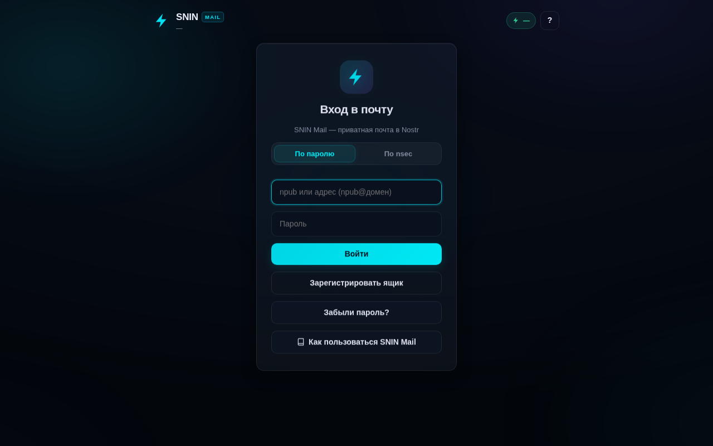
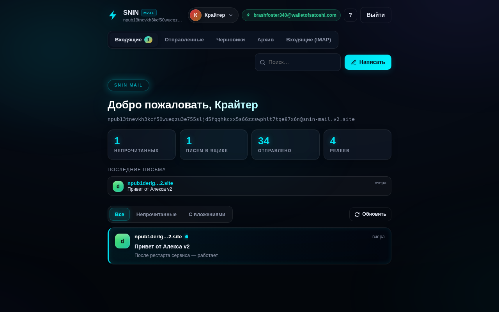
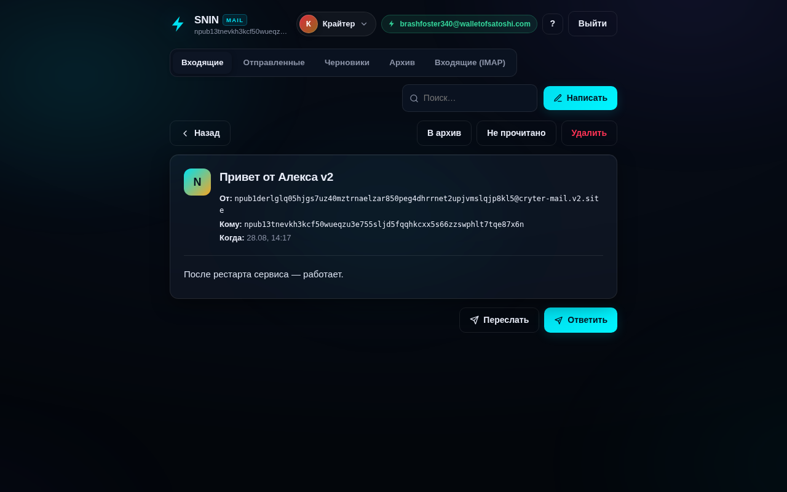

# SNIN Mail — веб-клиент

[](https://github.com/konantgit-sys/snin-mail-nostr/actions)
[](tests/)
[](https://www.python.org/)
[](LICENSE)

Децентрализованная почта поверх Nostr: письма — это NIP-59 gift-wrap события,
хранение — ваши ключи, вложения — Blossom (NIP-96). Клиент: FastAPI-бэкенд
+ esbuild-бандл фронта, дизайн в стиле SNIN Network.

*English version: [README.md](README.md)*

## Возможности

- **NIP-59** — письма шифруются на ключах отправителя/получателя (gift wrap)
- **Мульти-ящик** — 24+ аккаунта в одном клиенте, переключение в шапке
- **Вложения Blossom** — чанковая загрузка, превью, прогресс (NIP-96)
- **IMAP-мост** — импорт/чтение внешних ящиков
- **Черновики** — автосохранение при закрытии композера
- **Архив** — папка архивных писем
- **Очередь доставки** — мост → очередь → воркеры; письмо переживает рестарт
- **Премиум-дизайн** — aurora-фон, glass-панели, неон #00e0f0, mobile-first

## Скриншоты

| Вход | Входящие | Письмо |
|---|---|---|
|  |  |  |

## Быстрый старт

```bash
cp config.example.json config.json      # заполнить nsec/pubkey/relays/db
python3 -m uvicorn app:app --port 8123  # бэкенд
python3 build.py                        # фронт (нужен esbuild)
python3 -m pytest tests/ -q             # 115 passed, самодостаточные
```

Зависимость: пакет `mailbridge` из [nostr-mail-bridge](https://github.com/konantgit-sys/nostr-mail-bridge)
(добавить `src/` в `PYTHONPATH` или задать `NOSTR_MAIL_BRIDGE_SRC`).

## API и CLI

Полная документация — в английском [README.md](README.md): таблица API,
команды CLI (`scripts/mail_cli.py`), архитектура, деплой.

## Лицензия

[GNU AGPL-3.0](LICENSE)
